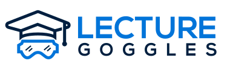

# Lecture Goggles API



This repository contains all of the code for the API. Lecture Goggles is a
free, open-source, educational resource repository to help students gain a better
understanding of school subjects.

## Build Status

|Master|Development|
|:-:|:-:|
|[](https://dev.azure.com/lecturegoggles-devops/lecture-goggles-api/_build/latest?definitionId=1&branchName=master)|[](https://dev.azure.com/lecturegoggles-devops/lecture-goggles-api/_build/latest?definitionId=1&branchName=development)|


## How to run
```bash
# Using pipenv
pipenv install
pipenv run flask run
# Using venv
rm requirements.txt
pipenv lock -r >> requirements.txt
python3 -m venv env
source ./env/bin/activate
pip install -r requirements.txt
flask run
--OR--
gunicorn --bind=0.0.0.0 --timeout 600 app:create_app
```